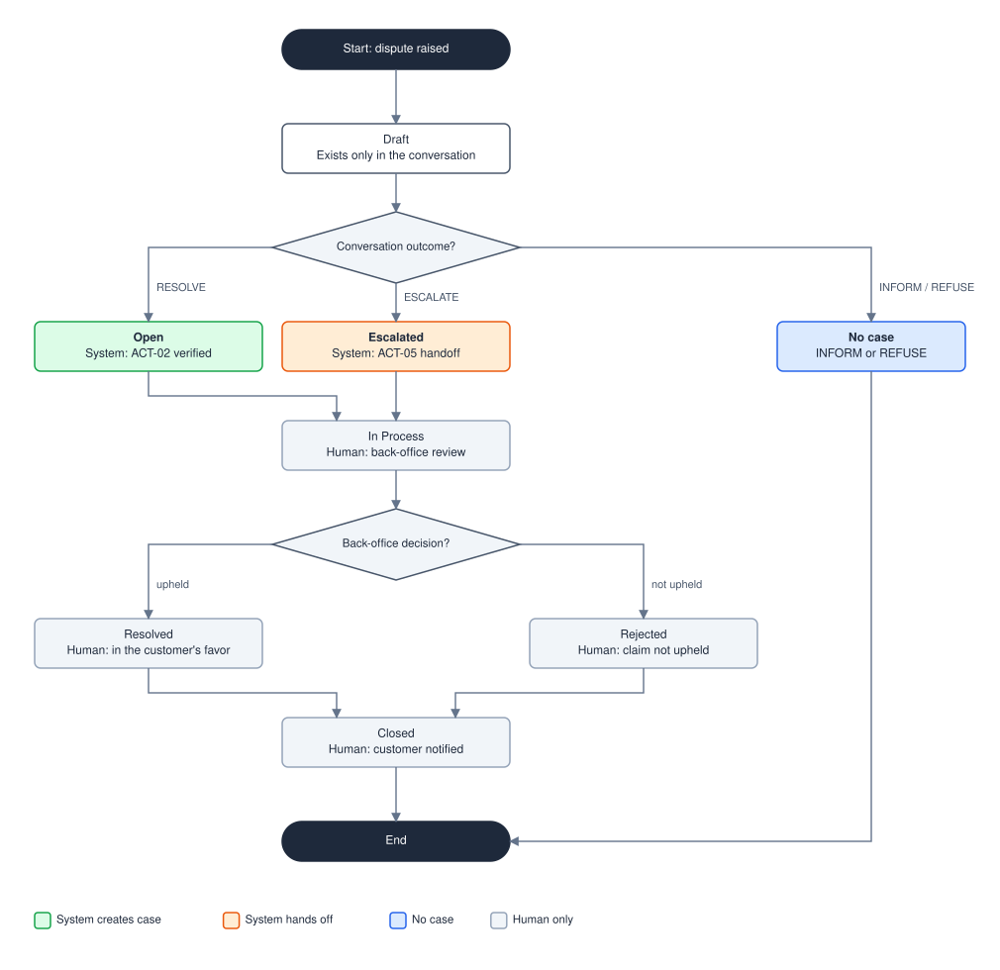

# Diagram: Dispute Case Lifecycle

| Field | Value |
|---|---|
| Status | Draft |
| Version | 0.2.0 |
| Last updated | 2026-09-25 |
| Related | [Dispute policy](../dispute-policy.md), [Glossary](../glossary.md) |

States of a dispute case and who may move it between them. State names follow the `complaints.status` values of the supplied data (`Open`, `In Process`, `Escalated`, `Resolved`, `Rejected`, `Closed`), plus `Draft`, which exists only inside a conversation.

## Who can make each transition

| From | To | Actor | Rule |
|---|---|---|---|
| Draft | Open | System | [ACT-02](../dispute-policy.md#8-actions-and-confirmations), after confirmation ([COM-03](../dispute-policy.md#11-customer-communication)) and read-back verification |
| Draft | Escalated | System | [ACT-05](../dispute-policy.md#8-actions-and-confirmations), triggered by any rule in [§7](../dispute-policy.md#7-mandatory-escalation-triggers) |
| Draft | No case | System | The outcome is `INFORM` or `REFUSE`, or the customer declines the summary |
| Open or Escalated | In Process | Human agent | Back office picks up the case |
| In Process | Resolved or Rejected | Human agent | Decision on the dispute |
| Resolved or Rejected | Closed | Human agent | Customer notified |

The system can create a case or hand it off, but it can never decide, close, or reopen one ([ACT-06](../dispute-policy.md#8-actions-and-confirmations)). Provisional credit is recorded as a flag when the case is opened and applied, if at all, by a human during `In Process`.

## Source

The SVG is generated by `scripts/render_diagrams.py` (function `render_lifecycle`). Edit the script, not the SVG, and run `python scripts/render_diagrams.py`.
