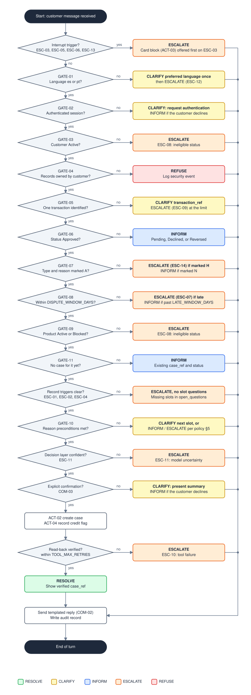

# Diagram: Dispute Decision Flow

| Field | Value |
|---|---|
| Status | Draft |
| Version | 0.2.0 |
| Last updated | 2026-09-25 |
| Related | [Dispute policy](../dispute-policy.md) |

How the deterministic policy engine evaluates one customer message about a disputed transaction. The order follows [dispute policy §5 (gates)](../dispute-policy.md#5-gates), [§7 (escalation triggers)](../dispute-policy.md#7-mandatory-escalation-triggers), and [§9 (outcomes)](../dispute-policy.md#9-outcomes-and-precedence). If this diagram and the policy disagree, the policy wins.



## How to read it

- **One evaluation per customer message.** Every branch ends the turn at the same place: the system sends a templated reply and writes the audit record. The next customer message starts a new evaluation from the top. This is why `CLARIFY` is an outcome of the turn and not a loop: the customer's answer arrives as a new message.
- **Left column**: the path to `RESOLVE`. Each decision continues downward when it passes.
- **Right column**: the single outcome of each decision that does not pass, colored by outcome type. Where a box names two outcomes, the policy row it refers to decides between them.
- **Interrupts first.** Triggers that can happen at any point in a conversation (a request for a human, legal or regulatory signals, account takeover indicators, repeated manipulation attempts) are checked before any gate. A first manipulation attempt is ignored and logged; it does not change the path.
- **Limits.** Clarifications are bounded by `MAX_CLARIFICATION_TURNS` and `MAX_TOTAL_CLARIFICATIONS`; exceeding them produces `ESCALATE` via `ESC-09` on the next evaluation.

## Source

The SVG is generated by `scripts/render_diagrams.py`. To change the diagram, edit the `FLOW` list in that script and run:

```bash
python scripts/render_diagrams.py
```
