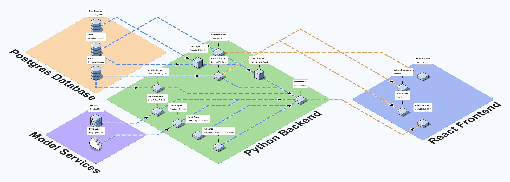

# Software Architecture

| Field | Value |
|---|---|
| Status | Draft |
| Version | 0.1.14 |
| Last updated | 2026-10-02 |
| Related | [Dispute policy](dispute-policy.md), [Glossary](glossary.md), [Decision flow](diagrams/dispute-decision-flow.md), [Case lifecycle](diagrams/dispute-case-lifecycle.md) |

## Contents

1. [Overview](#1-overview)
2. [Architecture diagram](#2-architecture-diagram)
3. [Components](#3-components)
4. [Request walkthrough](#4-request-walkthrough)
5. [Technology decisions](#5-technology-decisions)
6. [Deployment](#6-deployment)
7. [Security and data boundaries](#7-security-and-data-boundaries)
8. [Reliability](#8-reliability)
9. [Observability](#9-observability)
10. [Artifacts built offline](#10-artifacts-built-offline)
11. [Limitations and open items](#11-limitations-and-open-items)
12. [Change log](#12-change-log)

## 1. Overview

The system is a **modular monolith**: one Python backend split into modules with clear responsibilities, one React frontend, one PostgreSQL database, and one self-hosted decision model. Only components with a technical reason to run separately are separate services:

- **Kev** runs in its own container because it loads model weights and has a different lifecycle: it is retrained and replaced without touching the backend.
- **OpenAI** is an external API.

Everything else lives in the backend process. For a ten-day build by a single developer, fewer services mean fewer things to deploy, debug, and explain, while the module boundaries keep the design ready to split later.

The central design rule comes from the [dispute policy](dispute-policy.md#2-design-principles): **deterministic rules decide; models inform.** Models interpret language and produce signals. Only the Policy Engine decides outcomes, and only the Tool Layer executes actions, each with its own checks.

## 2. Architecture diagram

**Reading the diagram**

- The diagram shows only what runs at request time. Artifacts produced once, such as the loaded banking data and the model weights, are described in [§10](#10-artifacts-built-offline).
- Arrows show the direction in which data flows toward the user: from storage and models, through the backend, to the frontend.
- **Blue lines** carry data into and within the backend. **Orange lines** carry data from the backend to the frontend.
- **Cubes** mark the two components that decide and act: the Policy Engine and the Tool Layer.
- The diagram was drawn in [Isoflow](https://isoflow.io/). The PNG in `docs/diagrams/images/` is the exported version.

## 3. Components

### Storage: PostgreSQL 16 with SQLAlchemy and Alembic

| Component | What it does | Why it exists |
|---|---|---|
| **Core Banking** | Stores customers, products, and transactions loaded from the supplied dataset, keeping only the columns the system uses plus the fairness attributes ([DATA-06](dispute-policy.md#12-data-handling-and-fairness)). The application only reads it. | Source of truth for verified facts. Responses must be grounded in permitted account and transaction data. |
| **Cases** | Stores dispute cases and handoff packets. | Where actions are written and read back for verification ([ACT-02](dispute-policy.md#8-actions-and-confirmations)). |
| **Audit** | Stores sessions and the execution record of every turn. | Explanations must come from execution records, not from hidden model reasoning. |

### Model services

| Component | What it does | Why it exists |
|---|---|---|
| **Kev 0.8B** | Answers closed questions with probabilities: reason code, ambiguity, escalation risk, and manipulation attempts. Self-hosted, runs on CPU. | The learned component evaluated against a baseline. Cheap, fast, and its outputs can be measured and calibrated. |
| **GPT-6 Luna** (OpenAI API) | Understands the customer's free text and writes the sentences that connect templates. | Natural language in Spanish and Portuguese varies too much for rules. |

### Backend: Python 3.12 with FastAPI

| Component | What it does | Why it exists |
|---|---|---|
| **Orchestrator** | Receives each customer message and calls the other modules in order, running the LLM and Kev calls in parallel. | Single entry point per turn. Parallel calls reduce p50 and p95 latency. |
| **Identity Service** | Authenticates with a document number and a test OTP, and manages revocable sessions with expiry, using JWTs signed with HS256 only (PyJWT). The document is looked up by its HMAC. Its own lockout (`OTP_MAX_FAILURES` failed OTPs per document within a window) is separate from the policy's `AUTH_MAX_ATTEMPTS`, which counts conversation turns and is applied by the Orchestrator. A mock of a real identity provider. | The challenge requires a trusted test session; a customer ID alone does not prove identity ([GATE-02](dispute-policy.md#5-gates)). |
| **Input Guard** | Detects prompt injection and impersonation attempts before the text reaches the LLM, combining rules with a Kev question. | Prompt injection must be evaluated and handled ([ESC-13](dispute-policy.md#7-mandatory-escalation-triggers)). |
| **LLM Adapter** | Wraps the OpenAI API, requests JSON-schema structured outputs, and removes fields the model does not need. | Isolates the provider so a change is a configuration change. Enforces data minimization ([DATA-01](dispute-policy.md#12-data-handling-and-fairness)). |
| **Decision Client** | Queries Kev through its TypeSafe API (`POST /v1/systemone`) using `httpx`, with the closed questions of `config/kev_questions.yaml`: reason code (five codes plus `OTHER`), ambiguity, and escalation risk. Short timeout, no retries. If Kev is unavailable or answers outside the contract, the signals are derived from the LLM extraction of the current message (0/1, uncalibrated: the baseline Kev is evaluated against), with no extra model call. | Keeps the learned component behind one interface so it can be compared, replaced, and degraded safely. |
| **Policy Engine** | Evaluates gates, escalation triggers, and precedence. Parameters are read from a versioned `policy.yaml`. The only component that decides outcomes. | Policy must be enforced outside model-generated prose. Deterministic and unit-testable. The same code produces the reference labels for evaluation. |
| **Tool Layer** | Runs reads and actions (create case, block card) with its own permission checks, Pydantic contracts, idempotency keys, bounded retries (`tenacity`), and read-back verification. | Permissions must be enforced in the tool layer, and only verified actions may be reported. It refuses improper requests even if a model asks for them. |
| **Handoff Builder** | Builds the handoff packet for the human agent: verified facts, actions taken, triggered rules, and open questions. | Handoffs must carry useful context without the raw transcript ([policy §13](dispute-policy.md#13-handoff-packet)). |
| **Templates** | Holds versioned Spanish and Portuguese texts for every customer commitment. | Case references, deadlines, and refusals must not be freely generated ([COM-02](dispute-policy.md#11-customer-communication)). |
| **Audit & Tracing** | Assigns a `trace_id` to every turn and records the rules evaluated, calls made, results, latencies, and token usage. | Provides tracing and execution records, and feeds latency and cost metrics. |

### Frontend: React with TypeScript and Vite

One single-page application with four views:

| Component | What it does | Why it exists |
|---|---|---|
| **Customer Chat** | Customer conversation with OTP login, in Spanish or Portuguese. | Main demo surface. |
| **Agent Console** | Queue of escalated cases with their handoff packets. | Shows safe escalation to a human. |
| **Audit Viewer** | Displays the trace of each turn. | Makes the reason behind every decision visible to agents and reviewers. |
| **Metrics Dashboard** | Shows evaluation results and operational metrics, built with Recharts. | Communicates the measured quality and efficiency of the system. |

## 4. Request walkthrough

What happens when a customer sends one message. Step numbers match the order of the [decision flow](diagrams/dispute-decision-flow.md).

1. **Customer Chat** sends the message with the session token to the **Orchestrator**, which opens a trace.
2. **Identity Service** validates the session. If it is missing or expired, the turn ends with an authentication request: the LLM Adapter still reads the message (language, a request for a human, a legal signal) and the slots it extracts are kept for after the login, but Kev is not called (no rule before GATE-02 uses its signals) and neither are connecting sentences.
3. **Input Guard** checks the message for manipulation attempts.
4. In parallel, the **LLM Adapter** extracts candidate slot values and the **Decision Client** asks Kev for the reason code, ambiguity, and escalation risk.
5. The **Policy Engine** evaluates gates and triggers using the verified records it requests from the **Tool Layer**, the candidate slots, and the model signals. It returns exactly one outcome. When the transaction is not identified, the decision says what the search found (nothing, too many, or candidates from relaxed details) and which detail to ask for, and the reply tells the customer what was searched instead of repeating a generic question. A merchant named only as a kind of business ("un restaurante") is searched by `merchant_category` (word list in `config/merchant_categories.yaml`), and a period of days narrows the date. A connecting sentence the filter rejects is dropped without calling the model again; retries are only for network and schema errors.
6. If the outcome authorizes an action, the **Tool Layer** executes it, retries within bounds, and reads the result back. An unverified action is never reported to the customer.
7. On `ESCALATE`, the **Handoff Builder** writes the packet to Cases, where the **Agent Console** picks it up. The transfer text is sent once; every later message gets a neutral notice, reaches no model, and is added masked to the packet (`post_handoff_messages`) for the agent. If it could not be added (expired session, write failure), the notice does not say the agent will see it.
8. **Templates** produce the committed text; the LLM Adapter may add connecting sentences around it: full ones on the first turn and on bad news, at most a brief acknowledgment while the customer gives details, never a sentence already sent, never one that claims a state the system did not verify or an emotion the customer did not express, none for a request outside disputes, and in Spanish always addressing the customer as *usted*. Replies never show a window or threshold of the policy: the only number of days a customer sees is the resolution commitment, and an amount is shown with its currency code or, when the customer named none, as the plain number they gave. The same clarification text is never sent two turns in a row. A side question (refund, timeline, what a card block implies, the status of a filed dispute, or something outside disputes) is answered with its own template before the rest of the reply; it is not a clarification, and when it is all the message says, the pending question is asked again without counting it.
9. **Audit & Tracing** writes the turn record, and the Orchestrator returns the reply to **Customer Chat**.

## 5. Technology decisions

| Decision | Choice | Alternatives considered | Rationale |
|---|---|---|---|
| Backend language | Python 3.12 | Node.js with TypeScript | The Policy Engine must be the same code in production and in the reference labeler, and the decision model, training, and evaluation tooling are all Python. |
| Web framework | FastAPI | Flask | Native Pydantic validation for data contracts, `async` for parallel model calls, and automatic OpenAPI output that generates the frontend's TypeScript types. |
| Database | PostgreSQL 16 | SQLite | Handles concurrent writes from a public deployment and matches what a bank would operate. Runs as a single container. |
| ORM and migrations | SQLAlchemy 2 with Alembic | Prisma | Prisma Client Python was deprecated in March 2025 and archived in April 2025. SQLAlchemy is the standard Python ORM and integrates with FastAPI and Pydantic. |
| Conversational model | OpenAI GPT-6 Luna | Qwen (hosted API or self-hosted) | Reliable JSON-schema structured outputs and simple governance for a demo. Self-hosting large Qwen models is not possible on the available hardware. Cost is not a deciding factor at this scale. |
| Decision model | Kev 0.8B on CPU | Jev (hosted API), LLM structured output | Open weights, runs on the available hardware, can be fine-tuned, and exposes typed probabilities that can be calibrated. The LLM path remains as a fallback and as a comparison. |
| Architecture style | Modular monolith | Microservices | Fewer moving parts for a single developer in ten days, with module boundaries that allow a later split. |
| Frontend | React, TypeScript, Vite | Angular | Fast setup and a single app with four routes. |
| Deployment | Docker Compose | Kubernetes, managed services | One command to run anywhere: a personal server or a cloud VM. |

## 6. Deployment

The deployable unit is one Docker Compose project with four containers:

| Container | Contents | Exposed |
|---|---|---|
| `frontend` | React build served as static files | Public |
| `api` | FastAPI backend (all backend modules) | Public, behind rate limiting |
| `kev` | Kev server with its weights (`jaredpalmer/kev-0.8b`, TypeSafe API on port 8008) | Internal network only |
| `postgres` | PostgreSQL 16 | Internal network only |

**Kev container (M7).** Pinned to repository `jaredpalmer/kev@0fe8fc97c2bcc247fa3efb6e5c32af4e99770e91` and model snapshot `9a45d25eb2ab761841196625383fa1dff0e56c1e` (release 2026-09-24), served in bf16 at temperature 2.35. The image installs `flash-linear-attention==0.5.2` explicitly (it is missing from the repository's lock file) and starts the server with `--host 0.0.0.0`. The first call after start compiles the model (10.4 s on an RTX 3070; about 120 ms per new text afterwards), so the container makes one warm-up call at start and its healthcheck reports ready only after it. GPU is optional; latency is also measured on CPU for the deployment host.

The OpenAI API is called from the `api` container over HTTPS. Configuration and secrets come from environment variables (see `.env.example`); nothing secret is baked into images.

Target hosts, in order of preference: the developer's own server, or a cloud VM if hosting credits become available. The same Compose file is used in both cases.

## 7. Security and data boundaries

- **Permissions in the Tool Layer.** Every tool call uses the customer ID from the authenticated session, never from model output. Requests for other customers' records return `access_denied` ([GATE-04](dispute-policy.md#5-gates)).
- **Two database roles.** The application connects with a role that can only read Core Banking and can read and write Cases and Audit (no deletes, except expired OTP data). A separate owner role runs migrations and the Core Banking load (`scripts/sql/roles.sql`, `DATABASE_URL` and `MIGRATION_DATABASE_URL`). Because Core Banking is read-only, the mock card-block tool records blocks in `card_blocks`, and reads report a blocked card's `product_status` as `Blocked`. The handoff queue acknowledgement (ACT-05) is the packet written to `handoff_packets` and read back unchanged.
- **Audit access.** Turn traces are readable only with the agent role (`AGENT_API_TOKEN`, a bearer token separate from customer sessions, compared in constant time); a customer's session gets 403, so no customer reads any trace. Every read, granted or refused, is recorded as an `audit_access` event with the trace or filters asked for and the time. The customer's message is kept masked by default (`AUDIT_MESSAGE_MODE`), with the same minimization the LLM Adapter applies plus rules for numbers nobody announces. The agent console (M15) never ships the token in its JavaScript bundle or the repository: it asks for it on a sign-in screen and keeps it only in memory.
- **Policy outside prompts.** Outcomes and action authorizations come from the Policy Engine. Prompts cannot widen permissions.
- **Data minimization.** The LLM Adapter sends only the fields allowed by [DATA-01](dispute-policy.md#12-data-handling-and-fairness). Kev runs inside the deployment, so its inputs never leave it.
- **Internal services.** Kev and PostgreSQL are reachable only on the Compose internal network.
- **Abuse and cost limits.** The public API applies per-session rate limits and a token cap per conversation, and the OpenAI account has a spending limit.
- **Secrets.** Kept in `.env`, excluded from version control.

## 8. Reliability

| Failure | Handling |
|---|---|
| OpenAI call fails or times out | Bounded retries. If it still fails, the turn escalates or asks the customer to retry; no action is taken on partial output. |
| Kev unavailable | The Decision Client returns unavailable signals, the Orchestrator derives the fallback from the extraction of the current message, and the trace records `source = llm_fallback`. If the extraction failed too, the signals stay `unavailable` and count as uncertainty. |
| Tool write fails | Bounded retries with idempotency keys. After `TOOL_MAX_RETRIES`, the case escalates under [ESC-10](dispute-policy.md#7-mandatory-escalation-triggers). |
| Read-back mismatch | The action is treated as failed and escalated; the customer is not told it succeeded ([COM-04](dispute-policy.md#11-customer-communication)). |
| Session expired mid-conversation | The next evaluation stops at GATE-02 and asks the customer to authenticate again. A confirmation received with an expired session is not valid: after re-authentication, the COM-03 summary is presented again. |

## 9. Observability

Every turn has a `trace_id` that links the customer message, rule evaluations, model calls (with model and prompt versions, and Kev's own server latency next to the client's), tool calls, outcome, latency, and token usage. Every trace has an outcome and a `reply_kind`, also when the Policy Engine is not called (the card block offer and its repetitions are `CLARIFY`; a question outside disputes is `INFORM`), plus the side question answered, if any. Traces are stored in the Audit database and displayed in the Audit Viewer. The same records produce the operating metrics required by the challenge: p50/p95 latency, cost per attempted case and per successful automated resolution, containment, and the escalation rate by queue and rule (definitions in `app/audit/metrics.py`). Cost uses configured token rates, with cached input priced apart when the API reports it; otherwise it may be overestimated. Unsafe outcomes and escalation quality need reference labels, so they are computed in the evaluation (M18), not from traces.

## 10. Artifacts built offline

Some inputs to the running system are produced once, outside the request path:

| Artifact | Produced by | Consumed by |
|---|---|---|
| Core Banking data | `scripts/ingest.py` (raw CSV to silver Parquet: all partitions, deduplication by key, source file per row), then `scripts/load_core_banking.py` (silver to core Parquet: data contract, minimization, USD equivalent; then an idempotent upsert into PostgreSQL). Writes `reports/core_build.json`. | Tool Layer |
| Kev weights | Fine-tuning on team-generated, policy-labeled cases | Kev server |
| Calibrated thresholds | Validation split during model evaluation | `policy.yaml` |
| Evaluation reports | Evaluation harness running baseline and system on the held-out set | Metrics Dashboard, final submission |

The data and ML pipelines will be documented separately.

## 11. Limitations and open items

- The identity service, core banking data, and case store are mocks with documented contracts; they are not production integrations.
- A production deployment with strict data residency would replace the OpenAI API with a self-hosted model; that requires GPU hardware not available for this prototype.
- Kev 0.8B has a limited knowledge base and its calibration is verified only on our evaluation data.
- Kev is trained in English. In Spanish and Portuguese only two cases have been verified against the real server (`tests/fixtures/kev/`). As served (temperature 2.35), its `ambiguous` and `escalation_risk` answers sit near 0.5 and must not influence decisions until M7 recalibrates the temperature per question on the validation split.
- The conversational model is identified only by its alias: the API reports `gpt-6-luna` as the model and no `system_fingerprint`, so the provider can change the underlying model without notice. Mitigation: parser regression tests on recorded answers (`tests/fixtures/llm/`), and repeated runs per case in the evaluation (M18), since no `temperature` is sent.
- Capacity limits of the deployment have not been measured yet; they will be reported with the evaluation results.
- The audit API has no identity per agent: a single service token grants the agent role, so audit reads are recorded but not attributed to a person.
- Conversation state (accumulated slots, counters, the question pending) is kept in memory by the Orchestrator, in one process. The API therefore runs with exactly one worker (`python scripts/serve.py`); M19 must keep a single worker until the state moves to a shared store behind the same `ConversationStore` interface. A restart loses open conversations.
- Once a conversation reaches `LLM_MAX_TOKENS_PER_CONVERSATION`, the LLM is not called again and each turn behaves exactly as when `extract` is unavailable: empty slots, the rule-based interrupts (a request for a human or a legal signal is still honored), and Kev's signals, or unavailable signals when Kev does not answer either, which escalate under `ESC-11`. No policy rule is added for the cap.
- Kev's serving details (run and release date) are read from `GET /v1/models` after its first successful answer, not at startup, and cached; until then, or if that read fails (recorded as a `model_info` call), traces name the alias `kev-latest`.
- Two clocks: transaction-age rules use a simulated business date (`BUSINESS_DATE`, because the supplied data ends on 2026-06-17), while session age uses real time ([policy §15](dispute-policy.md#15-parameters)).

## 12. Change log

| Version | Date | Change |
|---|---|---|
| 0.1.0 | 2026-09-26 | First draft. |
| 0.1.1 | 2026-09-28 | Two clocks limitation; confirmation after mid-conversation session expiry (policy 0.2.0). |
| 0.1.2 | 2026-09-28 | Core Banking minimization and the offline loading pipeline (policy 0.3.0). |
| 0.1.3 | 2026-09-28 | Identity Service: document + OTP login, HS256 only, revocable sessions, OTP lockout. |
| 0.1.4 | 2026-09-28 | Limitation: the conversational model is identified only by its alias. |
| 0.1.5 | 2026-09-29 | Decision Client against the real Kev contract; fallback derived from the extraction; Kev limitations and container notes for M7. |
| 0.1.6 | 2026-10-01 | Database roles, card blocks and the simulated handoff queue (M9); audit access, message masking, cost and metrics; limitation: no identity per agent (M11). |
| 0.1.7 | 2026-10-01 | Orchestrator and chat API (M12): in-memory conversation state, token cap behavior, agent console endpoints for the handoff queue. |
| 0.1.8 | 2026-10-01 | M12 manual test fixes: side questions answered with templates, the card block offer names the charge and is never dropped in silence, every trace has an outcome and a reply kind, no Kev or connecting sentences before the login. |
| 0.1.9 | 2026-10-01 | M12 manual test 2: tolerant `GATE-05` search with relaxed candidates the customer picks, the search result told to the customer, clarifications answered with new details not counted toward `ESC-09`, `flow_help` side questions, connecting sentences by turn type and always *usted*. |
| 0.1.10 | 2026-10-01 | M12 manual test 3: generic merchants by category, periods of days (`extract@1.9.0`), `flow_help` only when the message brings no detail, connecting sentences never retried after the filter. |
| 0.1.11 | 2026-10-01 | M12 manual test 3, last fixes: the "card already blocked" notice only for a card blocked before the conversation; after RESOLVE or INFORM, a message with nothing to act on ("gracias") gets a closing reply instead of a new question. |
| 0.1.12 | 2026-10-02 | Injection test: after a handoff, a neutral `already_transferred` notice instead of the transfer text again; later messages added masked to the packet without any model. |
| 0.1.13 | 2026-10-02 | M13: with `extract` failed (or skipped by the token cap) and no Kev, the signals are unavailable (`ESC-11`), as §8 states; `GATE-02` informs on the turn after the last authentication request (policy 0.4.10). |
| 0.1.14 | 2026-10-02 | Policy 0.4.11: `extract@1.11.0` returns `unrecognized_reported`, the distinct charges the customer says in a message they do not recognize; the Orchestrator keeps the largest one and gives the engine the larger of it and the evaluated charges, so three in the first message escalate under `ESC-03` before any case. Without `extract`, only the evaluated charges count. A lost or stolen card is not `account_takeover_reported`. |
